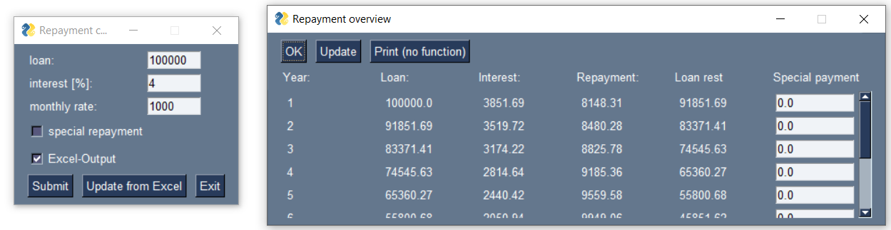

# Repayment calculator

Using PySimpleGUI to build a repayment calculator for debts.

## Authors

- [@Hendrik](https://www.github.com/henne23)

## Introduction

In this repository, I am trying to implement a simple repayment 
calculator using PySimpleGUI. I also tried to implement to 
MVC-concept for this project.
## Calculator

The calculator starts with a simple GUI that asks for the repayment
parameters such as loan amount, interest and monthly repayment rate.
In addition, it is possible to make special payments on an annual
basis. You can also choose to export your results to an
Excel file or not. Otherwise, the results will only be displayed on the screen.

On the results page, you can manually adjust the special repayments,
to see how this shortens the repayment period. 

It is also possible to adjust and "upload" the Excel output to
update the calculation (previous GUI).

Python (3.9)\
openpyxl (3.0.9)\
PySimpleGUI (4.60.4)\
numpy (1.20.3)\
pandas (1.3.4)

## Misc

23th Dec 2022:

At the moment there is no output function to get a PDF report 
for the results, what could be the next step.